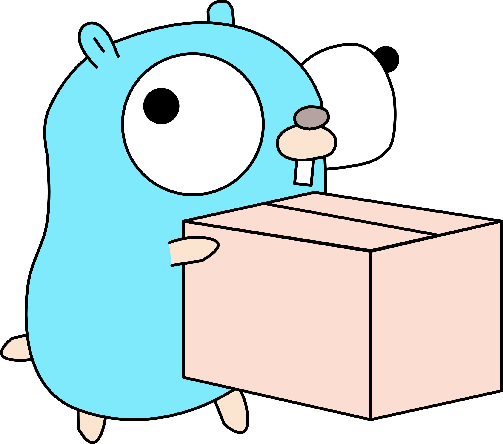

<h1 align="center">
	
  <br />
  Camogo
</h1>

<h3 align="center">
  A simple, reflection based IoC container for Go.

  [](https://github.com/yukitsune/camogo/actions?query=workflow%3Aci)
  [](https://goreportcard.com/report/github.com/yukitsune/camogo)
  [](https://pkg.go.dev/mod/github.com/yukitsune/camogo)
</h3>

# Usage
## Registering services
Before services can be resolved from the `Container`, they must first be registered.
There are two different ways to register a service.

### Modules
A module is simply a struct with a `Register(*Registrar) error` method.
```go
type ApiModule struct {
	Config *ApiConfig
}

func (m *ApiModule) Register(r *Registrar) error {
	
	// RegisterInstance will store the given instance in the container
	//  so that it can be resolved later
	r.RegisterInstance(m.Config)

	// RegisterFactory with a TransientLifetime will invoke the given func
	//  every time the funcs return type has been requested
	r.RegisterFactory(database.New, TransientLifetime)
	
	// RegisterFactory with a SingletonLifetime will invoke the given func
	//  the first time the funcs return type has been requested
	//  the resolved instance will then be re-used for every subsequent request
	r.RegisterFactory(logging.NewLogger, SingletonLifetime)
}
```

This module can then be provided to the container:
```go
m := &ApiModule{apiConfig}

c := container.New()
err := c.RegisterModule(m)
```

### Container
The `Container` itself provides a `Register` method for convenience which has same functionality as a `Module`.
```go
c := container.New()
err := c.Register(func (r *Registrar) error {
	...
})
```

### Notes on registering factories
Factories can only return one thing, which is what will be registered in the container.
An error may also be returned.

E.g:
```go
// Valid
func New() database.Connection {}
func New() (database.Connection, error) {}

// Not valid
func New() {}
func New() error {}
func New() (database.Connection, database.Config, ...) {}
```

If a factory is not valid then the `RegisterFactory` method will return an error.

If the factory has arguments, the container will attempt to resolve them.

## Resolving services
Services can be resolved from the container using the `Container.Resolve(interface{}) error` method. The `Resolve` method expects a function where the arguments are the services to resolve. An `error` can optionally be returned.
```go
err := container.Resolve(func (cfg *ApiConfig) error {
	...
})
```

# Contributing

Contributions are what make the open source community such an amazing place to be learn, inspire, and create. Any contributions you make are **greatly appreciated**.

1. Fork the Project
2. Create your Feature Branch (`feature/AmazingFeature`)
3. Commit your Changes
4. Push to the Branch
5. Open a Pull Request
